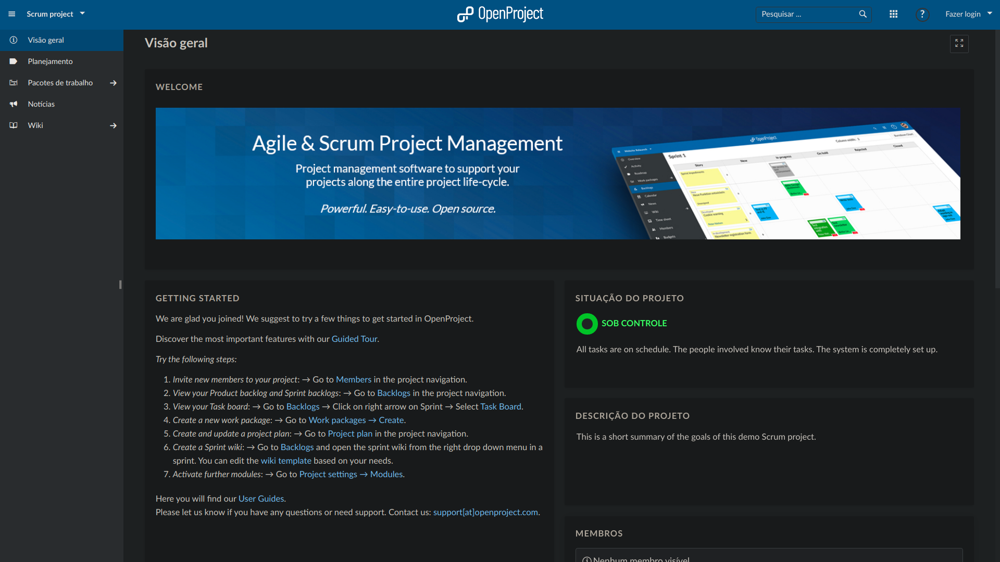

<h1>
  
</h1>

## **Open source project management software**

#### **Efficient classic, agile or hybrid project management in a secure environment**

 
 

OpenProject is an OpenSource project manager used by technology giants.With it it is possible to implement and manage different types of projects, of different methodologies, with different sizes.

It is widely used in companies like Siemens, The Linux Fundation, Greenpeace, in addition to several others.

<h3 align="center">
  <b>
    Focused on agile methodologies, Scrum and Kanban.
  </b>
   
  <a href="https://www.openproject.org/" target="_blank">https://www.openproject.org/</a>
</h3>

 

### **Installation**

Installation can be a little tricky on some operating systems, but if you are using Ubuntu, Debian, CentOs or Suse, you can count on packages already available and install easily:

 
<h3 align="center">
  <a href="https://docs.openproject.org/installation-and-operations/installation/packaged/" target="_blank">Official Packages</a>
</h3>
 

If you are using more "caliente" systems like Arch Linux(👏🎉) or something closer to Shrek like Windows, you can perform the installation using Docker! I leave some options here that may help you:

 

- [OpenProject: Docs Official](https://docs.openproject.org/installation-and-operations/installation/docker/)

- [In last case, Virtual Machines - OpenProject: Docs Official](https://docs.openproject.org/installation-and-operations/installation/univention/)

  - [Univention App](https://www.univention.com/products/univention-app-center/app-catalog/openproject/)

 

Personally I use Arch Linux, it was the first time until today that I can't find the package in any Arch cumunity repository.However, I was able to install easily using Docker and following the official documentation tutorial.

Once installed it should start at:

 

  <a href="http://localhost:8080/" target="_blank">http://localhost:8080/</a>

 

 

### **Docs**

Here you will find all the official OpenProject documentation, as well as a "small" community that can help you:

 

  <a href="https://docs.openproject.org/" target="_blank">https://docs.openproject.org/</a>

 

### **Interface and Tools**

 

#### **Home Interface**

</img>

You should come across something similar when installing OpenProject and start working on your projects :D Remember to create other projects you must log in admin:admin

#### **Demo Scrum**

</img>

This is a demo of a project using the agile Scrum methodology, the presentation is divided into widgets of description, status, among others.

#### **Dashboards**

</img>

The initial project dashboard already proposes a series of filters for workload and general view of the project's progress over time.

#### **Planning**

</img>

In this section we have access to all the project planning, such as the backlog and the sprints.

#### **Work Packages**

</img>

Finally, the work packages, with filters such as Id, Subject, Type, Status, Assignment, Priority.

### **Conclusions**

 

This manager is very light, practical and very complete, full of resources that can and will help you. In addition, of course, to have a simple installation, different from others like the Taiga, not to mention the super smooth learning curve. It is a good alternative to Trello, it goes beyond a simple digital board for you to nail your Post-it's.

  
  
  
  
  
  
  

